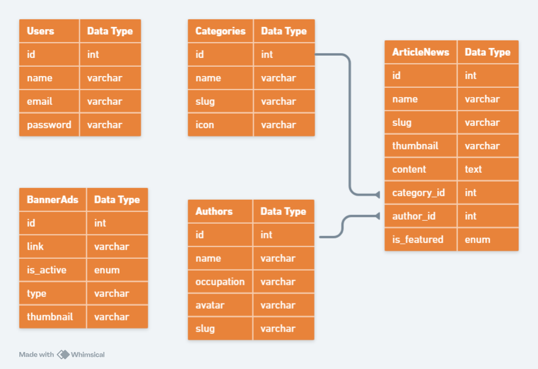

<h1 align="center">Magabwa</h1>

<div align="center">

&nbsp;
&nbsp;

</div>


<p align="center">This repository is web application that aims to provide features such as CMS (Content Management System) for creating blog/article content. This app is built using Laravel, Filament, Docker</p>

## Table of Contents

-   [Tech Stack](#tech-stack)
-   [Entity Relationship Diagram](#entity-relationship-diagram-erd)
-   [Running on Localhost](#running-on-localhost)
    -   [Clone this repository](#clone-this-repository)
    -   [Copy & fill .env](#copy--fill-env)
    -   [Application URL](#application-url)
    -   [Database Configuration](#database-configuration)
    -   [Install dependency package](#install-dependency-package)
    -   [Generate key](#generate-key)
    -   [Running the migration and seeder](#running-the-migration-and-seeder)
    -   [Running the application](#running-the-application)

## Tech Stack

-   [Laravel](https://laravel.com) (`Framework`): Laravel is a PHP framework designed for web development with an expressive and elegant syntax. It provides a comprehensive ecosystem with features such as routing, sessions, caching, and authentication, enabling developers to build robust and scalable web applications easily.
-   [Filament](https://filamentphp.com) (`Full-stack components`): A collection of beautiful full-stack components. The perfect starting point for your next app.
-   [Docker](https://www.docker.com/) (`Container`): Docker is a platform designed to help developers build, share, and run container applications. We handle the tedious setup, so you can focus on the code.

## Entity Relationship Diagram (ERD)



## Running on Localhost

### Clone this repository

> **NOTE**: If you are using Laragon or XAMPP you can specify the clone directory destination to your `www` or `htdocs`, for example
>
> ```bash
> git clone https://github.com/armandwipangestu/magabwa.git Z:/laragon/www/magabwa && cd magabwa
> ```
>
> or
>
> ```bash
> git clone https://github.com/armandwipangestu/magabwa.git C:/xampp/htdocs/magabwa && cd magabwa
> ```
>
> But if you just running using php web server you can place the clone directory anywhere

```bash
git clone https://github.com/armandwipangestu/magabwa.git && cd magabwa
```

### Copy & Fill .env

```bash
cp .env.example .env
```

After `.env.example` copied to `.env` now fill with your own configuration at this variable

### Application URL

You can change this `APP_URL` variable with your own configuration, for example if I running with laragon, I use pretty url which is will create a Virtual Host and mapping the local domain to the web server like `https://magabwa.dev`.

If you running with the php web server you can just edit this variable with this value `http://localhost:8000`

```bash
APP_URL=http://localhost
```

### Database Configuration

```bash
DB_CONNECTION=mysql
DB_HOST=127.0.0.1
DB_PORT=3306
DB_DATABASE=laravel
DB_USERNAME=root
DB_PASSWORD=
```

### Install dependency package

```bash
composer install
```

### Generate key

```bash
php artisan key:generate
```

### Running the migration and seeder

```bash
php artisan migrate:fresh --seed
```

### Running the application

> **NOTE**: If you are using laragon pretty url like me, you can skip this part because it already running on local domain because virtual host. But this part will be use for the port forwarding (ngrok or vscode) and testing midtrans payment

```bash
php artisan serve
```

Now you can access the application on `http://localhost:8000`

## License

The Laravel framework is open-sourced software licensed under the [MIT license](https://opensource.org/licenses/MIT).
